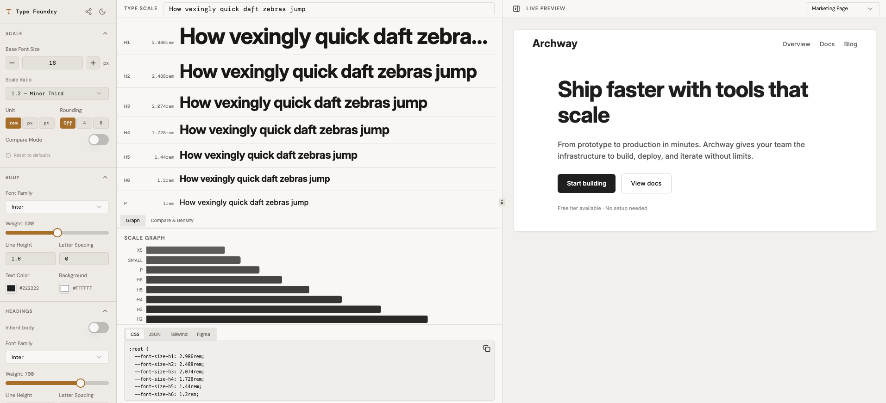

# Type Foundry

A visual type scale design tool for crafting beautiful, consistent typography systems. Try it live at **[type-foundry.vercel.app](https://type-foundry.vercel.app/)**.



## Features

- **Type Scale Generator** — Set a base font size and scale ratio (Minor Second through Golden Ratio, or custom) to generate a harmonious type scale
- **Compare Mode** — Overlay two scale ratios side-by-side to compare how they look in practice
- **Live Preview** — See your type scale applied to real UI layouts: Marketing Page, Article, Product UI, Blog, E-Commerce, Documentation, and Portfolio
- **Font Selector** — Choose from system fonts or 40+ Google Fonts for body and heading type
- **Responsive Breakpoints** — Configure separate base sizes and ratios per breakpoint (Mobile, Tablet, Desktop)
- **Presets** — Quickly load curated type systems: Editorial, Product UI, Marketing, Dense Dashboard, and Readable Blog
- **Save & Load Systems** — Name and persist your type configurations in browser localStorage
- **Export** — Copy or download your type scale as CSS variables, JSON tokens, Tailwind config, or Figma tokens
- **Accessibility Panel** — Get scale density feedback and warnings about potential readability issues
- **Share** — Generate a shareable URL that encodes your current configuration
- **Light / Dark Mode** — Toggle between themes with automatic color adjustments
- **Unit Support** — Switch between `rem`, `px`, and `pt` output

## Tech Stack

- [Vite](https://vitejs.dev/) + [React](https://react.dev/) + [TypeScript](https://www.typescriptlang.org/)
- [Tailwind CSS](https://tailwindcss.com/)
- [shadcn/ui](https://ui.shadcn.com/) component library
- [Radix UI](https://www.radix-ui.com/) primitives
- [Bun](https://bun.sh/) (recommended) or Node.js / npm

## Local Setup

### Prerequisites

- [Node.js](https://nodejs.org/) v18+ (or [Bun](https://bun.sh/) v1+)
- Git

### Steps

```sh
# 1. Clone the repository
git clone https://github.com/glenn-goh/type-foundry.git
cd type-foundry

# 2. Install dependencies
bun install
# or: npm install

# 3. Start the dev server
bun run dev
# or: npm run dev
```

Open [http://localhost:5173](http://localhost:5173) in your browser.

### Other commands

```sh
# Production build
bun run build

# Preview production build locally
bun run preview

# Lint
bun run lint

# Run tests
bun run test
```

## Deployment

The project is deployed on Vercel. To deploy your own fork:

1. Push the repository to GitHub
2. Import the project at [vercel.com/new](https://vercel.com/new)
3. Vercel will auto-detect the Vite framework — no extra configuration needed
4. Click **Deploy**

## License

MIT
